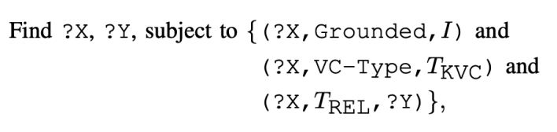

# FVQA
Reviews of FVQA work

## 0.KB-VQA@arxiv 2015 Nov

## 1.FVQA @ TPAMI 2017

首先关于FVQA的细节:

图像来自COCO和ImageNet，其中COCO有更多复杂的context，然后Imagenet就是有更多的object categories。visualconcept包括object/scene/action。2）FVQA的数据集特点就是知识会直接链接到image中的concept，这个也叫做visual concept。3)数据集都是需要图像和知识一起回答的。(几十万个fact)。4）DBpedia/ConceptNet/WebChild。80%questions来自ConceptNet，14来自DBpedia，6来自Webchild。

#### 和KB-VQA的区别
比如single annotated knowledge source，我们使用的是两个额外的extracted knowledge bases。
#### 和bAbI的区别@FB
我们的问题必须结合image和KB来回答。
#### 我们的问题不包括Yes/No questions，因为答案只和concept有关@image/kb。这里只是用reasoning。
#### 我们就是结合visual concept(X,Grounded,I) and (X,VC-Type,T).这里就是来自多个KB的concept会直接链接到对应的concept。@Unified KB。
#### 问题只需要一个fact triplet，所以不是multihop的。
使用的方法:
非end-to-end。

1.Model 1: question query mapping:@Seq2Seq
将每个问题分类 至32个不同的<TKVC,TREL,TAS>.找到对应的key visual object和关系，以及对应的answer source。
TVC:Object/Scene/Action三种选项；
REL:13 different values
TAS: image/KB

2.然后用这个来匹配对应的pattern.

3.最后的问题就是我们从这么多里面如何选择合适的candidates。
当answer source是visual的时候就是算出哪个y和question最匹配；当answer source是KB的时候就是算出哪个visual concept与问题最匹配。但是这里做的都是关键词或者等操作，而不是semantic vector的。

Cons:
首先这种方法is vulnerable to misconceptions due to synonyms and homographs.(同义词和同形异意词)

## 2.LEARNING-BASED FVQA @ ECCCV 2018（问题分解的思考）
Motivation：
1.避免directly learn an embedding of facts and question-image pairs into a space that permits to assess their compatibility.

都是针对FVQA的工作吗，本质上学习的就是给定一张图和问题，我们需要做的事是answer source寻找的工作～(Image,KB).
1.检索正确的fact
2.检索正确的answersource。@二分类问题

#### 那么关于如何检索

## 3.Learning Visual knowledge Memory Networks for Visual Question Answering
Motivation:
1.现有的知识VQA的手段大多都是依赖于找到那个fact，可是这个太困难了。所以会损失很多acc
2.textqa中key-value memory network是很有意义的。

我们使用KB KV-memory network来完成本次的任务。

### Input Module:
这里就是多模态融合咯。这里采用的很粗糙哎。--visual attentive description。 for query purpose。
##

## 2.In Defense of Grid Features for Visual Question Answering
### Motivation:
1. 这里就是bottom-up attention, bbx have recently surpassed vanilla grid-based as the de facto standard for vision and language tasks like VQA.(de facto standard表示业界标准)./dominate the leaderboard

2.但是目前人们无法确认是否是这个更好的定位@regions导致了bottom-up的成功。我们这里对grid进行了重新的实验设计，他们也可以工作的很好。same acc@一倍多的速度bonus～

3.同时我们验证我们的方法在其他的tasks表现也很好，比如image caption～
